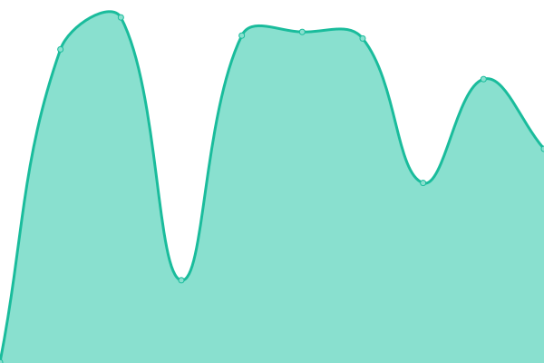

# [📈 Live Status](https://Suiattle.github.io/upptime): <!--live status--> **🟩 All systems operational**

This repository contains the open-source uptime monitor and status page for [Suiattle](https://Suiattle.github.io/upptime), powered by [Upptime](https://github.com/upptime/upptime).

With [Upptime](https://upptime.js.org), you can get your own unlimited and free uptime monitor and status page, powered entirely by a GitHub repository. We use [Issues](https://github.com/Suiattle/upptime/issues) as incident reports, [Actions](https://github.com/Suiattle/upptime/actions) as uptime monitors, and [Pages](https://Suiattle.github.io/upptime) for the status page.

<!--start: status pages-->
<!-- This summary is generated by Upptime (https://github.com/upptime/upptime) -->
<!-- Do not edit this manually, your changes will be overwritten -->
<!-- prettier-ignore -->
| URL | Status | History | Response Time | Uptime |
| --- | ------ | ------- | ------------- | ------ |
|  [City of Seattle Official Website](https://www.seattle.gov) | 🟩 Up | [city-of-seattle-official-website.yml](https://github.com/Suiattle/upptime/commits/HEAD/history/city-of-seattle-official-website.yml) | 

 350ms
     
 | 

<a href="https://Suiattle.github.io/upptime/history/city-of-seattle-official-website">100.00%</a>
    

|  [Seattle Services Portal](https://services.seattle.gov/portal/) | 🟩 Up | [seattle-services-portal.yml](https://github.com/Suiattle/upptime/commits/HEAD/history/seattle-services-portal.yml) | 

 432ms
     
 | 

<a href="https://Suiattle.github.io/upptime/history/seattle-services-portal">98.85%</a>
    

|  [Seattle Services Portal Help Center](https://seattlegov.zendesk.com/hc/) | 🟩 Up | [seattle-services-portal-help-center.yml](https://github.com/Suiattle/upptime/commits/HEAD/history/seattle-services-portal-help-center.yml) | 

 384ms
     
 | 

<a href="https://Suiattle.github.io/upptime/history/seattle-services-portal-help-center">100.00%</a>
    

|  [Permit and Property Records Search](https://web.seattle.gov/dpd/edms/) | 🟩 Up | [permit-and-property-records-search.yml](https://github.com/Suiattle/upptime/commits/HEAD/history/permit-and-property-records-search.yml) | 

 242ms
     
 | 

<a href="https://Suiattle.github.io/upptime/history/permit-and-property-records-search">100.00%</a>
    

|  [Permit & Site History Research Tool](https://maps.seattle.gov/sdcipermithistory/) | 🟩 Up | [permit-and-site-history-research-tool.yml](https://github.com/Suiattle/upptime/commits/HEAD/history/permit-and-site-history-research-tool.yml) | 

 236ms
     
 | 

<a href="https://Suiattle.github.io/upptime/history/permit-and-site-history-research-tool">100.00%</a>
    

|  [Shaping Seattle Maps](https://web.seattle.gov/sdci/ShapingSeattle/) | 🟩 Up | [shaping-seattle-maps.yml](https://github.com/Suiattle/upptime/commits/HEAD/history/shaping-seattle-maps.yml) | 

 78ms
     
 | 

<a href="https://Suiattle.github.io/upptime/history/shaping-seattle-maps">100.00%</a>
    

|  [City of Seattle Vehicle Safety Inspection Database](https://web6.seattle.gov/FAS/Vsid) | 🟩 Up | [city-of-seattle-vehicle-safety-inspection-database.yml](https://github.com/Suiattle/upptime/commits/HEAD/history/city-of-seattle-vehicle-safety-inspection-database.yml) | 

 300ms
     
 | 

<a href="https://Suiattle.github.io/upptime/history/city-of-seattle-vehicle-safety-inspection-database">100.00%</a>
    

|  [Seattle Animal Shelter Online Licensing](https://onlinelicensing.petpoint.com/OnlineLicensing/) | 🟩 Up | [seattle-animal-shelter-online-licensing.yml](https://github.com/Suiattle/upptime/commits/HEAD/history/seattle-animal-shelter-online-licensing.yml) | 

 252ms
     
 | 

<a href="https://Suiattle.github.io/upptime/history/seattle-animal-shelter-online-licensing">100.00%</a>
    

|  [Seattle Municipal Court Payments](https://secure8.i-doxs.net/SeattleSMC/) | 🟩 Up | [seattle-municipal-court-payments.yml](https://github.com/Suiattle/upptime/commits/HEAD/history/seattle-municipal-court-payments.yml) | 

 524ms
     
 | 

<a href="https://Suiattle.github.io/upptime/history/seattle-municipal-court-payments">100.00%</a>
    

|  [Seattle Utilities ePortal](https://myutilities.seattle.gov/eportal/) | 🟩 Up | [seattle-utilities-e-portal.yml](https://github.com/Suiattle/upptime/commits/HEAD/history/seattle-utilities-e-portal.yml) | 

 241ms
     
 | 

<a href="https://Suiattle.github.io/upptime/history/seattle-utilities-e-portal">100.00%</a>
    

|  [Seattle Utility Services One-time Payment](https://utilities-self-service.ebill.seattle.gov/SeattleUtilities/OneTimeAdd.aspx) | 🟩 Up | [seattle-utility-services-one-time-payment.yml](https://github.com/Suiattle/upptime/commits/HEAD/history/seattle-utility-services-one-time-payment.yml) | 

 292ms
     
 | 

<a href="https://Suiattle.github.io/upptime/history/seattle-utility-services-one-time-payment">100.00%</a>
    

<!--end: status pages-->

[**Visit our status website →**](https://Suiattle.github.io/upptime)

## 📄 License

- Powered by: [Upptime](https://github.com/upptime/upptime)
- Code: [MIT](./LICENSE) © [Anand Chowdhary](https://anandchowdhary.com), supported by [Pabio](https://pabio.com)
- Data in the `./history` directory: [Open Database License](https://opendatacommons.org/licenses/odbl/1-0/)
